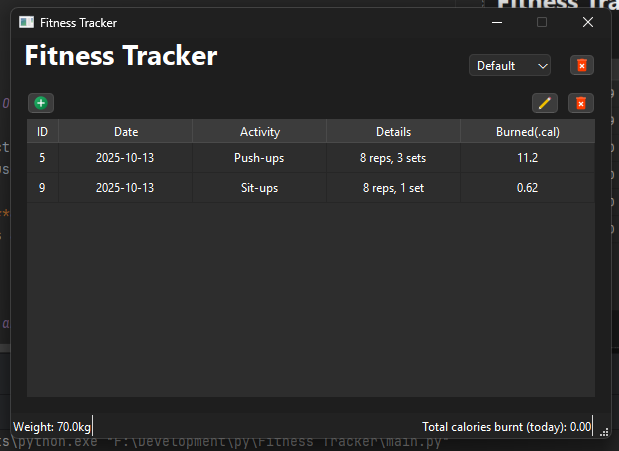
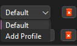
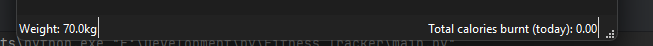
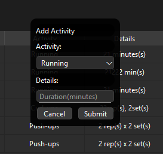
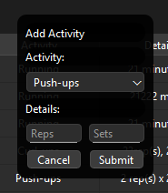
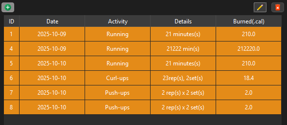
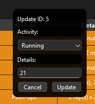
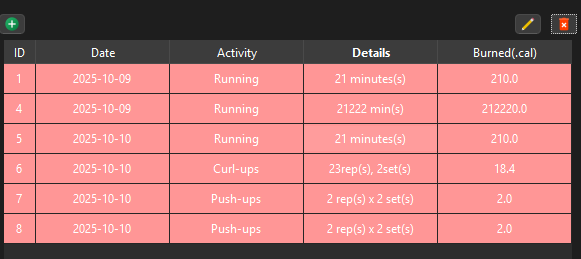
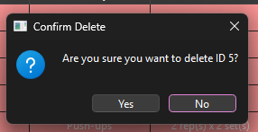

## Fitness Tracker

### Glicerio Tenajeros Jr. - BSCS

---

## Project Overview

This project is a simple **Fitness Tracker** app built using Python and PyQt6.  
It allows users to select an activity (such as running, walking, curl-ups, or push-ups), then calculates the estimated calories burned based on duration (for timed activities) or reps and sets (for repetition-based exercises).

Program app can have multiple profiles and can be **added** or **delete**
Users can **add**, **update**, and **delete** their own activity records.  
All entries and users are stored in a local **SQLite3 database** for persistent tracking and are displayed in a table inside the app.

---

## Purpose and Usefulness

This fitness tracker is designed for individuals who want a lightweight, offline tool to manually log their workouts and track their progress over time.  
Its straightforward UI makes it ideal for personal use, especially when a full-featured fitness app is unnecessary.

---

## Technologies Used

- **Python 3**
- **PyQt6** – for GUI design
- **SQLite3** – for local database storage
- **`re`** – regular expressions (for string parsing)
- **`sys`** – system-level operations
- Custom-built Python modules for UI components and data handling

---

## Features

- **Add / Update / Delete Entries**  
  Easily log your workouts, modify existing records, or remove them when no longer needed.

- **Persistent Data Storage**  
  Entries and user profiles are stored in an SQLite database. When the app launches, 
  all records are loaded automatically, ensuring data is always available.

- **User Profiles**
  Create and manage multiple user profiles, each with its own unique weight settings. 
  The user profiles are stored in the SQLite user table, 
  and each profile's weight is used to calculate personalized calorie burns based on activities.

- **Calorie Calculation**  
  Calories are estimated based on activity type and either duration or reps × sets, taking the user's weight into account for more accurate estimates.

- **Status Bar Footer**
  A dynamic footer indicator displays the current user's weight and the total calories burned today, giving real-time feedback on progress.

- **Interactive Activity Table**  
  A central table displays all entries in real-time, updating immediately after each add, update, or delete action.

- **Mode-Based Interaction**  
  - 🟢 **Add Mode:** Opens a centered pop-up form with fields for activity, duration or reps/sets, and submit/cancel buttons.  
  - 🟡 **Update Mode:** Highlights rows in yellow; clicking a row opens the same form pre-filled for editing.  
  - 🔴 **Delete Mode:** Highlights rows in red; clicking a row prompts a confirmation dialog before deletion.

- **Compact Activity Table**  
  A fixed-size table displays all recorded entries clearly. It updates instantly after adding, updating, or deleting records.

## 🗂️ Project Structure

This project follows a modular structure, separating logic, UI components, and resources to improve readability and maintainability.

## 📐 Code Style & Organization

- Code is split into **logical modules** (backend) and **UI widgets** (frontend).
- File and folder names follow **snake_case**.
- Class names use **PascalCase**, while variables and functions use **camelCase** or **snake_case** depending on clarity.
- Each module or widget is self-contained and focused on a single responsibility.
- Reusable styles and sizing constants are centralized in `common.py`.
- Widget creation is streamlined via `builder.py` for consistency.

---

## 📸 Screenshots

### 🖥️ Main Interface with Table

### 👤 User Profile Interaction

### 🔢 Status Bar

### 🧾 Entry Form (Add Time Base)

### 🧾 Entry Form (Add Time Base)

### 🧾 Entry Form (Add Reps/Sets Base)

### ✏️ Update/Modify mode

### 🧾 Modify Form

### 🗑️ Delete Mode

### 🗑️ Delete Prompt

---

## 🚀 How to Run the Program

1. Make sure Python 3.11 is installed.
2. Open your project folder in an IDE or terminal.
3. Run the main file using: python main.py